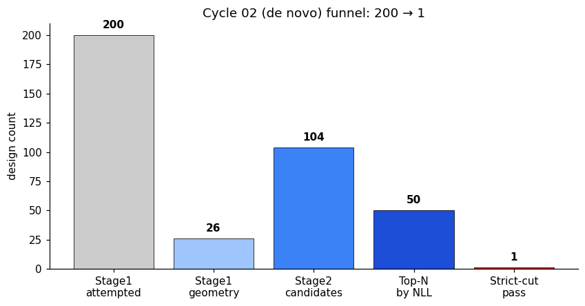
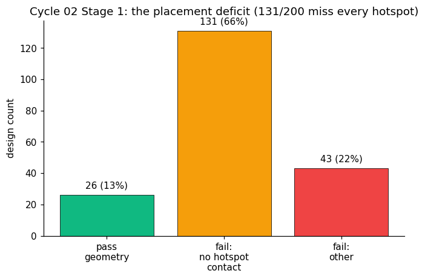
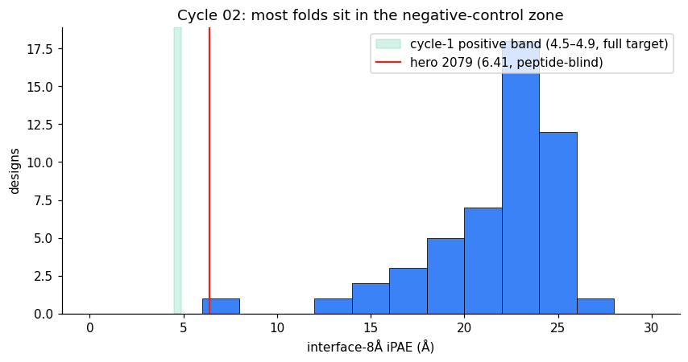
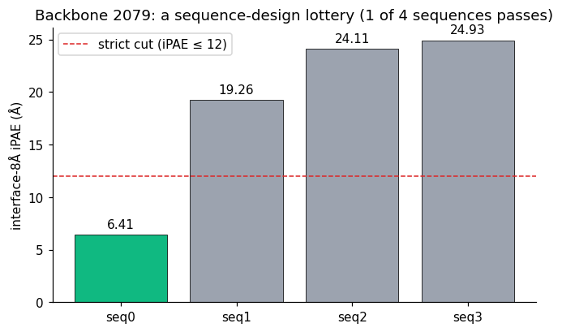
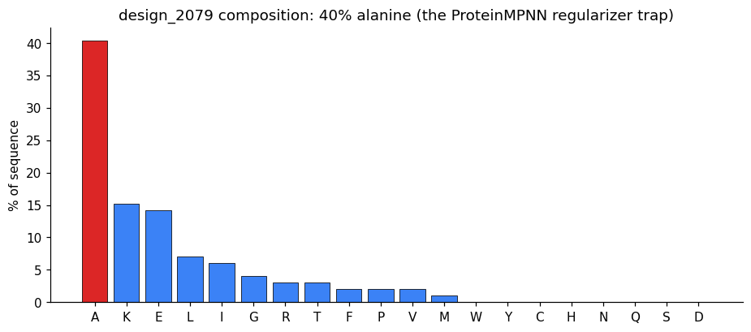

# Cycle 02 — de novo generation

Detailed results for the cycle-02 de novo campaign. Summary and cross-cycle framing are in [narrative.md](narrative.md) §6; the scaffold-based follow-up is in [cycle_03.md](cycle_03.md); conceptual lessons in [methodological_lessons.md](methodological_lessons.md). All values are in-silico AF2-predicted geometry.

---

## 1. Design

Cycle 02 ran the full four-chain target end to end with de novo RFdiffusion backbones, no ProteinMPNN amino-acid bias, and `num_recycles=3`.

| Knob | Value |
|---|---|
| Generation | de novo RFdiffusion (`T=50`) |
| Target | full 4-chain: A=HLA heavy (275) · B=β2m (100) · C=peptide RMFPNAPYL (9) · D=binder |
| ProteinMPNN bias | none |
| Sampling | 4 sequences/backbone |
| AF2 recycles | 3 |
| Stored iPAE definition | interface-8 Å (Johansen et al. [1], Fig. 1B) |

---

## 2. Funnel

| Stage | Input | Output | Yield |
|---|---|---|---|
| RFdiffusion backbones | — | 200 | — |
| Geometry pass | 200 | 26 | 13% |
| ProteinMPNN (4 seqs/backbone) | 26 | 104 | — |
| AF2-multimer fold (top 50 by NLL) | 50 | 50 | — |
| Strict cut (iPAE ≤ 12 **and** ipLDDT ≥ 88) | 50 | **1** | **2%** |

The interface-8 Å distribution: median 22.66 Å, ~70% of folds (35/50) in the 20–25 Å range (the cycle-1 negative zone), min 6.41 Å (the single passing design), max 26.17 Å.







AF2 reads most designs as coherent four-helix bundles that simply do not contact the binding cleft with confidence — the placement deficit propagating from Stage 1, which ProteinMPNN cannot repair.

---

## 3. The hero, reclassified

design_2079_seq00 was the single design to cross the strict cuts and was originally reported as a positive-band win. The peptide-contact decomposition (narrative §7) overturns that reading.

| Property | Value |
|---|---|
| Length / topology | 99 aa, four-helix bundle |
| BSA | 976 Ų (within the Liu et al. [2] minibinder range 800–1200) |
| `iface_tot` | 6.41 (above the cycle-1 full-target positive band 4.5–4.9 — weak even in aggregate) |
| ipLDDT | 91.1 |
| `iface_pep` | **inf** (no binder atom within 8 Å of the peptide) |
| `iface_mhc` | 6.41 (the entire interface is MHC framework) |
| closest binder→peptide distance | **28–40 Å** |

Per-residue contact analysis (`design_2079_peptide_contacts.txt`; chains A=HLA / B=peptide / C(=D)=binder; AF2-predicted geometry):

| Peptide pos | role | min dist (Å) | closest binder res | PAE to binder | contact |
|---|---|---|---|---|---|
| P1-R | N-term | 40.49 | 53 | 12.56 | — |
| P2-M | anchor, buried | 34.74 | 53 | 10.95 | — |
| P3-F | semi-exposed | 37.59 | 53 | 13.13 | — |
| P4-P | exposed | 38.04 | 53 | 12.90 | — |
| P5-N | exposed, specificity | 36.97 | 53 | 13.55 | — |
| P6-A | exposed | 33.34 | 53 | 12.98 | — |
| P7-P | exposed | 32.82 | 53 | 13.13 | — |
| P8-Y | exposed, specificity | 31.50 | 53 | 11.59 | — |
| P9-L | anchor, buried | 28.30 | 53 | 12.09 | — |

Every peptide residue is 28–40 Å from the nearest binder atom, with high PAE (low confidence) throughout. design_2079 is a peptide-blind MHC-framework binder that docks on a distal MHC surface; its 6.41 was entirely framework contact, and the aggregate metric never revealed that the peptide — the entire point of the target — was tens of ångströms away. This is the result that demonstrates why the peptide-resolved metric is necessary, and it is the project's most useful negative.

---

## 4. Two further qualifications

**The backbone is a sequence-design lottery, not a robust scaffold.** The four ProteinMPNN sequences on backbone 2079 scored iPAE 6.41 (passing) / 19.26 / 24.11 / 24.93 — only one finds a binder-like configuration. A robust scaffold yields a tight cluster of passing sequences because geometry, not sequence, sets docking; here three of four fail. (Backbones 2179 and 2100 produced 4/4 well-folded bundles but 0/4 passing — beautiful folds that never touch the cleft.) The cycle-03 fix of sampling more sequences per backbone addresses this false-negative mode, though it does not touch the deeper placement problem.



**The sequence is 40.4% alanine** — the unconstrained ProteinMPNN regularizer trap:

```
AAAEKAKEAAKKFKEAAKIAAEKGAEAGIKAIREIGKELLAAAATPAMEALGKAALAAAAAIAAELAAFPERAAEITKRTVAAAKELAKAAEEVAKALK
```

Composition: A 40%, K 15%, E 14%, L 7%, I 6%, G 4%, R 3%, T 3%, F/P/V 2% each, M 1% — zero W, Y, C, H, N, Q, S, D. AF2 does not penalize this, but low-complexity sequences carry elevated aggregation risk in expression and yeast display, and the absence of W/Y removes any UV/A280 quantitation handle. Both Liu et al. [2] and Householder et al. [4] apply a negative alanine bias for exactly this reason; cycle 02 did not. Cycle 03 crushed alanine to ~4% (see [cycle_03.md](cycle_03.md) §4) — a real wet-lab-tractability fix that, importantly, did not change the peptide-engagement problem, which is upstream of sequence design.



---

## 5. What cycle 02 established

- The full pipeline runs end to end on the calibrated assay (Stage 0 → Stage 2 → halt gate).
- The dominant failure mode is **placement**: de novo backbones that fold well but dock away from the peptide groove, with the loss propagating intact through ProteinMPNN and AF2.
- The two visible candidate defects (lottery backbone, alanine) were addressed in cycle 03; the invisible one (peptide-blindness, exposed only by the decomposed metric) was not, and motivated the metric audit and the cycle-04 conditioning fix.

The original cycle-02 analysis notebook (`notebooks/cycle_02_report.ipynb`) predates the metric audit and frames 2079 as a positive-band hero; it is superseded by this page.

## Data & code

- [Master design table — both cycles](../results/master_design_journey.csv) — includes all 50 cycle-02 folds, both iPAE definitions
- [13_design2079_peptide_contacts.py](../analysis/scripts/13_design2079_peptide_contacts.py) — reproduces the §3 contact table (the 2079 reclassification)

---

*References as numbered in [narrative.md](narrative.md).*
