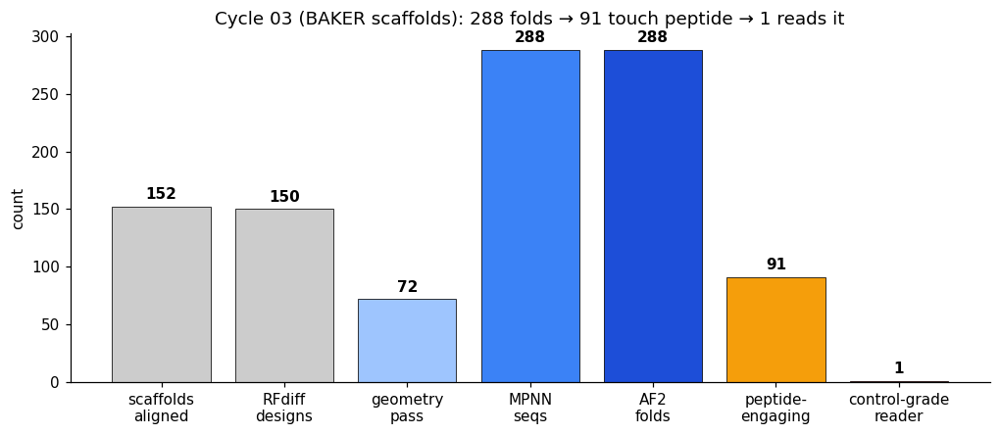
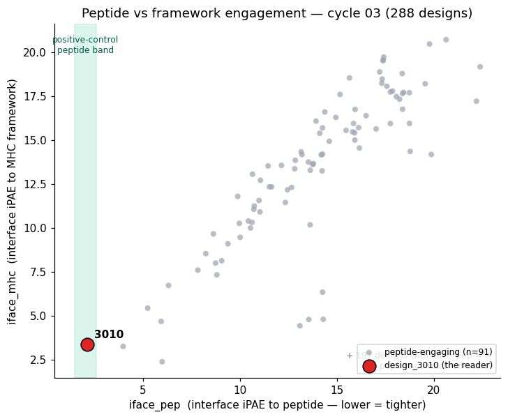
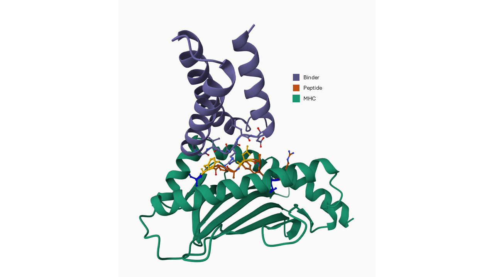

# Cycle 03 — BAKER-scaffold partial diffusion (sub-run A)

Detailed results for the cycle-03 scaffold-based campaign. Summary and cross-cycle framing are in [narrative.md](narrative.md); conceptual lessons in [methodological_lessons.md](methodological_lessons.md). All values are in-silico AF2-predicted geometry.

---

## 1. Design

Cycle 03 replaced de novo backbone generation with **partial diffusion from published BAKER scaffolds** [2], on a truncated target.

| Knob | Cycle 02 | Cycle 03 sub-run A |
|---|---|---|
| Generation | de novo (`T=50`) | partial diffusion (`partial_T=15`) from 152 aligned BAKER scaffolds |
| Target | full 4-chain (HLA + β2m + peptide + binder) | truncated 3-chain (HLA α1/α2 [1:180] + peptide + binder) |
| Chain layout | A=HLA, B=β2m, C=peptide, D=binder | A=HLA, B=peptide, C=binder |
| ProteinMPNN bias | none | A: −2.0; E/L/R: +1.0 (`configs/proteinmpnn_bias_aa.json`) |
| AF2 recycles | 3 | 6 |
| Sampling | 4 seqs/backbone | 4 seqs/backbone |

These are five simultaneous changes; the comparison to cycle 02 is not controlled (see narrative §11).

---

## 2. Funnel

| Stage | Output | Rate |
|---|---|---|
| Scaffolds aligned | 152 | — |
| RFdiffusion designs (1 per scaffold) | 150 | 150 unique scaffolds; 2 of 152 unsampled (length/selection) |
| Geometry pass | 72 | 48% (vs 13% in cycle 02) |
| ProteinMPNN sequences (72 × 4) | 288 | — |
| AF2-multimer folds | 288 | — |
| Peptide-engaging (`iface_pep` finite) | 91 | 32% |
| Control-grade peptide reader (`iface_pep` in 1.46–2.60) | **1** | — |

The geometry pass rate jumped to 48%, and even cycle-03 *failed* designs have better placement than cycle-02's typical attempt (median hotspot contacts: c03-fail 1, c02-pass 4, c03-pass 6.5). Partial diffusion is also ~8× faster per design (median 18 s vs 145 s GPU inference). But the funnel's end states tell the real story: of 288 designs, only 91 touch the peptide at all, the median engager sits at `iface_pep` 14.2 (barely a contact), and exactly one design reaches the positive-control band.

A new failure mode appeared: 15 of 78 cycle-03 geometry failures (19%) were length-out-of-range, because partial diffusion preserves the BAKER scaffold's binder length and some scaffolds fall outside the 70–110 contig. Cycle-04 fix: pre-filter the scaffold library by binder length.

---

## 3. Scaffold lineage

Scaffold ancestry was recovered from each design's `.trb` (`config['inference']['input_pdb']`), e.g. design_3054 ← `aligned/scaf158.pdb`. Two findings:

**Bimodal HLA-CA RMSD, exact.** Of 152 scaffolds, 56 sit at < 1 Å (A\*02:01-native), 95 at 4–6 Å (cross-allele), 1 at > 6 Å — with a literal zero in the 1–4 Å range. The BAKER library is curated so scaffolds either fit A\*02:01 natively or come from cleanly distinct allele geometries.

**Cross-allele scaffolds outperform native (counter-intuitive).** Native (< 1 Å) scaffolds passed at 38%; cross-allele (4–6 Å) at 54% — a 16-point gap in the "wrong" direction. Mechanism: native scaffolds inherit their original BAKER target-peptide register (MART-1/gp100/NY-ESO), and `partial_T=15` is insufficient to remodel them onto WT1, so the binder stays locked to the wrong register; cross-allele scaffolds are "freer" and get repositioned toward the WT1 groove by the alignment step. **Consequence:** HLA-CA RMSD is the wrong pre-filter; cycle 04 should pre-filter on binder-to-peptide proximity instead.

**Note on lineage claims.** The BAKER library has no published scaffold-to-target-peptide mapping; scaffolds are a generic reusable pool. The honest framing is "design_3054 descends from scaf158, a cross-allele topology in BAKER cluster 1" — not "from a BAKER wt1 binder."

**Cluster heterogeneity.** k = 8 clustering gives pass rates from 27% (cluster 7, the largest at n = 51) to 92% (cluster 2, n = 12, short binders). The 48% aggregate is a misleading average; pre-selecting high-pass clusters could lift yield toward 70–80%.

---

## 4. Sequence composition (the AA bias)

The ProteinMPNN bias did what it was configured to do, with collateral effects:

| Feature | Cycle 02 | Cycle 03 |
|---|---|---|
| frac Ala | 0.467 | 0.037 |
| frac (Glu + Arg) | 0.178 | 0.542 |
| frac hydrophobic | 0.616 | 0.277 |
| net charge | −1.6 | −9.1 |
| ProteinMPNN NLL (mean) | 0.90 | 1.19 |

The alanine trap that flagged the cycle-02 hero (40% Ala) was crushed to ~4% — a real fix for wet-lab tractability. But charged residues displaced hydrophobics, net charge went strongly anionic, and sequences became less probable under ProteinMPNN's own model (NLL +0.30). Crucially, the bias did **not** fix peptide engagement — it addressed a tractability problem, not the specificity problem, which is structural (narrative §10).

---

## 5. Candidate picture under the metric audit

The originally stored cycle-03 metrics used the position-slice iPAE (Bennett-style); recomputing on interface-8 Å (narrative §5) reordered the candidates. Of the slice-ranked top 10, only 3 engage the peptide at all.

| Design | scaf / cluster | `iface_tot` | `iface_pep` | `iface_mhc` | Reading |
|---|---|---|---|---|---|
| design_3084_seq02 | — | 1.56 | — | — | Best overall interface + ipTM 0.89; what a standard funnel ranks #1 |
| design_3054_seq00 | scaf158 / 1 | 1.61 | **inf** | — | Framework champion; tightest MHC binder, zero peptide |
| **design_3010_seq00** | scaf109 / 6 | 2.98 | **2.10** | 3.35 | **The peptide reader** — only design in the positive band |

This table is the blind-spot argument in one frame: a standard funnel ranking on `iface_tot`/ipTM picks 3084 or 3054 and never sees 3010, the only design that reads the peptide. design_3010 is also distinctive in sequence — the only hero with cysteines (n = 2), elevated Tyr, lowest hydrophobicity, and net charge −8 (the cycle-03 median, i.e. *not* charge-unusual); ProteinMPNN was less confident in it (score 1.14 vs 3054's 0.86), yet it produced the lowest `iface_pep` of all 288.

The original top-5 by slice (3054, 3010, 3103, 3002, 3063) all descend from cross-allele scaffolds (RMSD 4.13–5.92 Å; scaf158/109/51/100/17) spanning 3 of 8 clusters — diversity at the top is real but constrained.

---

## 6. design_3010 per-residue contact analysis

Chains confirmed: A = HLA (180 res), B = peptide RMFPNAPYL (1–9, no offset), C = binder (73 res). Distances are AF2-predicted geometry.

| Peptide pos | role | min dist (Å) | binder residues < 5 Å |
|---|---|---|---|
| P1-R | N-term | 7.09 | — |
| P2-M | anchor, buried | 6.81 | — |
| P3-F | semi-exposed | 5.67 | — |
| P4-P | exposed | 2.09 | E57 |
| P5-N | exposed, specificity | 2.34 | G54, R55, L56, E57, E60 |
| P6-A | exposed | 3.12 | V53, G54, R55 |
| P7-P | exposed | 3.45 | G52, V53, G54 |
| P8-Y | exposed, specificity | 2.71 | L48, R49, G52, V53, G54, R55 |
| P9-L | anchor, buried | 4.40 | R49 (graze) |

The binder makes its tight (≤ 3.5 Å) contacts exclusively on the central bulge P4–P8. The anchors P2-Met (6.81 Å) and P9-Leu (4.40 Å graze) are not engaged, and the flanks P1/P3 are untouched. Both specificity residues are contacted — N5 (2.34 Å) and Y8 (2.71 Å, PAE 4.17). A single contiguous binder segment (48–60) forms the reader, and **R55 contacts both N5 and Y8** — the specificity linchpin. This is the "reads WT1" outcome required for genuine peptide specificity per Householder et al. [4], and it yields the falsifiable cycle-04 test: mutating N5, Y8, or binder R55 should collapse `iface_pep` while `iface_mhc` holds.

.

---

## 7. Why most designs miss — structural, not compositional

A charge-driven explanation for framework bias was hypothesized (anionic binders favoring the charged MHC walls) and falsified: peptide-engaging designs are *more* anionic than peptide-blind ones (−12.4 vs −7.6), the opposite of the prediction. The single-backbone control is decisive — on scaf158, seq00 gives `iface_pep` inf and seq01 gives 5.23: same backbone, different sequence, peptide contact barely moved. Backbone placement sets the regime; ProteinMPNN modulates only at the margin. Framework bias is an RFdiffusion placement property (narrative §10), and BAKER-scaffold reuse — by inheriting framework-favoring topologies — slightly reduced peptide engagement relative to de novo (32% vs 40%).

---

## 8. What cycle 04 takes from this

- Peptide-only hotspot conditioning at Stage 1 (drop MHC hotspots A65/66/150/155) — fix the diagnosed placement cause.
- Pre-filter the scaffold library by binder-to-peptide proximity (not HLA-CA RMSD), by binder length (kill length-out-of-range), and from high-pass clusters.
- Scale 10–50×, run BindCraft [7] alongside RFdiffusion, and add the ipSAE-based filter cascade [8] plus the `iface_pep` gate (narrative §12).
- Run the 3010 specificity test (N5A/Y8A mutants + off-target panel).

## Data & code

- [Master design table — both cycles](../results/master_design_journey.csv) — 50 cycle-02 + 288 cycle-03 folds, both iPAE definitions
- [Candidate dossier](../results/cycle_03/analysis/candidate_dossier.csv) — ranked cycle-03 candidates
- [Scaffold lineage](../results/cycle_03/analysis/scaffold_lineage.csv) — 152 BAKER scaffolds: HLA-RMSD, cluster, pass rate
- [design_3010 structure (AF2 model)](../results/cycle_03/analysis/design_3010_seq00_af2_model.pdb) — the validated lead
- [12_design3010_peptide_contacts.py](../analysis/scripts/12_design3010_peptide_contacts.py) — reproduces the §6 contact table

Supporting data committed to the repo: `results/cycle_03/analysis/master_design_journey.csv` (the full 338-design funnel with both iPAE definitions), `candidate_dossier.csv`, `scaffold_lineage.csv`, the two hero contact tables (`design_3010_peptide_contacts.txt`, `design_2079_peptide_contacts.txt`), and the single validated structure `design_3010_seq00_af2_model.pdb`. The raw 288-design AF2 output set stays on the pod, reproducible from the committed configs.
